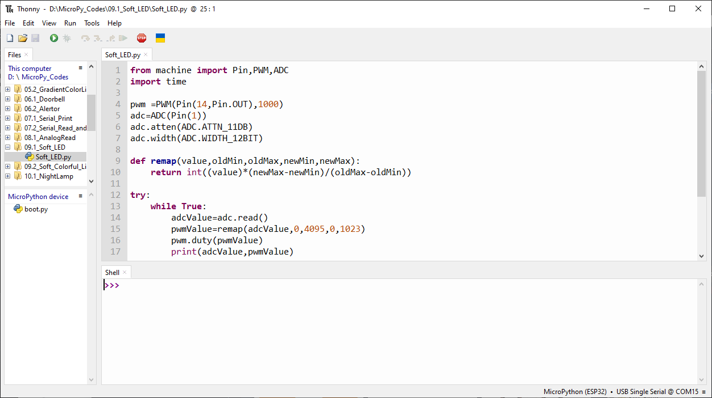

Chapter 9 Potentiometer & LED
===============================
We have already learned about the use of ADC and PWM. In this chapter, we will 
learn how to use a potentiometer to control the brightness of LED.

Project 9.1 Soft Light
--------------------------
In this project, we will make a soft light. We will use an ADC Module to read ADC 
values of a potentiometer and map it to duty cycle of the PWM used to control the 
brightness of a LED. Then you can change the brightness of a LED by adjusting the 
potentiometer.

Component List
^^^^^^^^^^^^^^^
- ESP32-S3-WROOM x1
- GPIO Extension Board x1
- 830 Tie-Points Breadboard x1
- Resistor 220Ω x1
- Potentiometer(10k) x1
- LED x1
- Jumper Wire x5

Connect
^^^^^^^^^^^^
.. image:: img/connect/9.1.png

Code
^^^^^^^
Move the program folder “Basic_Starter_Kit_for_ESP32_S3/Python/Python_C
odes” to disk(D) in advance with the path of “D:/Micropython_Codes”.

Open “Thonny”, click “This computer” >> “D:” >> “Micropython_Codes” >> “09.1_Soft_L
ED” and double click “Soft_LED.py”.

**09.1_Soft_LED**

Click “Run current script”. Rotate the handle of potentiometer and the brightness 
of LED will change correspondingly. 

The following is the code:

.. code-block:: python

    from machine import Pin,PWM,ADC
    import time

    pwm =PWM(Pin(14,Pin.OUT),1000)
    adc=ADC(Pin(1))
    adc.atten(ADC.ATTN_11DB)
    adc.width(ADC.WIDTH_12BIT)

    def remap(value,oldMin,oldMax,newMin,newMax):
        return int((value)*(newMax-newMin)/(oldMax-oldMin))

    try:
        while True:
            adcValue=adc.read()
            pwmValue=remap(adcValue,0,4095,0,1023)
            pwm.duty(pwmValue)
            print(adcValue,pwmValue)
            time.sleep_ms(100)
    except:
        pwm.deinit()

In the code, read the ADC value of the potentiometer. The ADC value range is 
0-4095. However, the default input range of the duty() function is 0-1023. 
Therefore, we need to write a remap() function to map the read ADC value to a 
value that conforms to the input range of the duty() function.